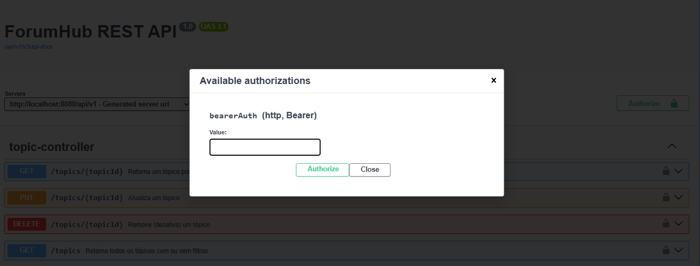

# FórumHub - API REST 
### 📝 Apresentação
Este projeto é uma solução para o desafio **Challenge Back End da Alura**, juntamente com a **Oracle**, no programa **ONE** **(Oracle Next Education)** onde o objetivo é desenvolver uma API REST para gerenciamento de tópicos em um fórum, permitindo que usuários criem, consultem, atualizem e excluam tópicos e respostas.

###  🔍 Visão Geral
A aplicação foi construída com Spring Boot e segue as boas práticas de design REST, validação de dados, tratamento de erros, autenticação/autorização e persistência com banco de dados relacional. Para facilitar o ambiente de desenvolvimento e testes, foi utilizada uma instância do PostgreSQL executada em Docker. O versionamento e a gestão do esquema do banco de dados foram realizados por meio de migrações automatizadas.

---

## 🚀 Funcionalidades

A API oferece endpoints para as seguintes operações:

### 📌 Tópicos
- Criar um novo tópico
- Listar todos os tópicos (com filtros por autor, curso, categoria e status)
- Consultar um tópico específico por ID
- Atualizar um tópico (restrito ao autor, moderador ou admin)
- Excluir (desativar) um tópico

### 💬 Respostas
- Criar uma nova resposta a um tópico
- Listar todas as respostas
- Consultar uma resposta específica
- Atualizar uma resposta (restrito ao autor, moderador ou admin)
- Excluir (desativar) uma resposta

### 📚 Cursos e Categorias
- CRUD completo de cursos e categorias (acesso restrito a admins)

### 👤 Usuários
- Listar todos os usuários
- Buscar um usuário por ID

---

## 🔒 Segurança

O sistema implementa controle de acesso com:

- **JWT (JSON Web Token)** para autenticação
- **Roles (Perfis)**: `ADMIN`, `MODERATOR`, `USER`
- Regras específicas para permitir ações apenas a usuários autorizados, com verificação de propriedade dos recursos quando necessário.

---

## 🧰 Tecnologias Utilizadas

- **Java 21**
- **Spring Boot 3**
- **Spring Security**
- **Spring Data JPA**
- **Hibernate**
- **PostgreSQL**
- **Flyway - versionamento do banco com migrations**
- **Lombok**
- **Jakarta Validation**
- **Swagger / OpenAPI (Springdoc)** – documentação interativa da API
- **JWT** – autenticação segura

---

## 🗃️ Modelagem do Sistema

Com base no diagrama do banco de dados fornecido, foi desenvolvido um **diagrama de classes** para guiar a construção da API.

### 📊 Diagrama do Banco de Dados


A modelagem de classes foi feita a partir das entidades principais do banco de dados (`Usuário`, `Tópico`, `Curso`, `Resposta`, etc.) e suas **relações**, visando representar fielmente a estrutura lógica e os comportamentos esperados no domínio da aplicação.

### 🧱 Diagrama de Classes


Essa estrutura orientada a objetos permitiu:

- Identificar claramente as responsabilidades de cada entidade.
- Definir relacionamentos entre objetos (ex: um `Usuário` pode criar vários `Tópicos`, um `Tópico` pode ter várias `Respostas`).
- Organizar a lógica da aplicação conforme os conceitos de **coesão**, **encapsulamento** e **responsabilidade única**.

O diagrama de classes serviu como **base para a implementação das entidades JPA** e facilitou a construção dos **serviços, repositórios e controladores** da API REST.

---

## 🚀 Como rodar o projeto localmente

Para executar esta aplicação localmente, siga os passos abaixo:

### 1. Clone o repositório

```bash
git clone https://github.com/seu-usuario/nome-do-projeto.git
cd nome-do-projeto
```
### 2. Configure o banco de dados

- Dentro de **src/main/resources/** edite o arquivo **application.properties** ou **application.yml**, com as configurações do seu banco de dados local:
```
spring.datasource.url=jdbc:postgresql://localhost:5432/forumhub
spring.datasource.username=seu_usuario
spring.datasource.password=sua_senha
```
- ⚠️ Certifique-se de que o banco de dados PostgreSQL está rodando na sua máquina e que o banco forumhub foi criado.

### 3. Rode a aplicação

- Com o banco configurado, execute a aplicação (por exemplo, via IDE como IntelliJ, Eclipse, ou pelo terminal):
```bash
./mvnw spring-boot:run
```

### 4. Ao iniciar

- As migrations serão executadas automaticamente na primeira vez que a aplicação rodar, criando todas as tabelas e relacionamentos do banco de dados.
- Uma classe `InitializerConfig` será executada automaticamente para facilitar os testes iniciais, onde ela fica responsável por:


- Criar os **perfis padrão**: `ADMIN`, `MODERATOR` e `MEMBER`
- Criar um **usuário associado a cada perfil**, com as seguintes credenciais:

```
| Perfil     | E-mail                 | Senha     |
|------------|------------------------|-----------|
| ADMIN      | admin@forumhub.com     | 12345678  |
| MODERATOR  | moderator@forumhub.com | 12345678  |
| MEMBER     | member@forumhub.com    | 12345678  |
```

> 🔐 Todos os usuários são criados apenas **se ainda não existirem** no banco de dados, garantindo que o processo seja idempotente (ou seja, pode ser executado várias vezes sem causar duplicações).

Essa configuração inicial facilita o acesso e testes manuais da API logo após o primeiro start.

---

## Testes com Swagger UI 🧪

Após iniciar a aplicação e com os dados iniciais carregados no banco, você pode acessar a documentação interativa da API através do Swagger:

### 🔗 Acesse: `http://localhost:8080/api/v1/swagger-ui.html`

### ✅ Teste com autenticação

A API está protegida com autenticação baseada em **JWT**. Para testar os endpoints protegidos no Swagger:

1. Acesse o endpoint de autenticação no próprio Swagger (`/auth/login`).
2. Faça login com um dos usuários padrão (por exemplo, `admin@forumhub.com` / `12345678`).
3. Copie o token JWT retornado na resposta.
4. Clique no botão **"Authorize"** no topo do Swagger UI.
5. Cole o token no campo que aparecerá assim como na imagem abaixo:



- Agora você poderá testar qualquer endpoint da API com autenticação ativada.

> 💡 **Dica:** Se estiver usando perfis com diferentes permissões (`ADMIN`, `MODERATOR`, `MEMBER`), você pode testar os comportamentos específicos de acesso de cada perfil.

---
## Bagde de Entrega do Desafio

